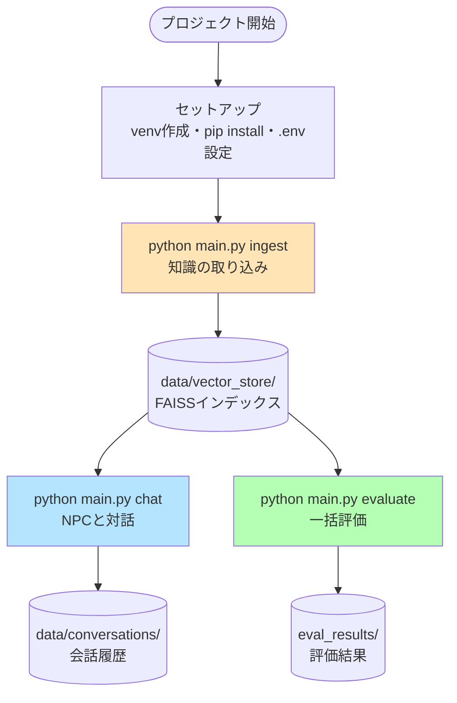
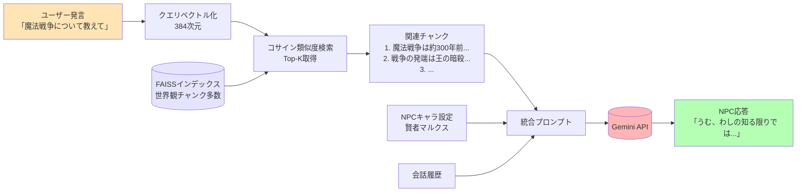
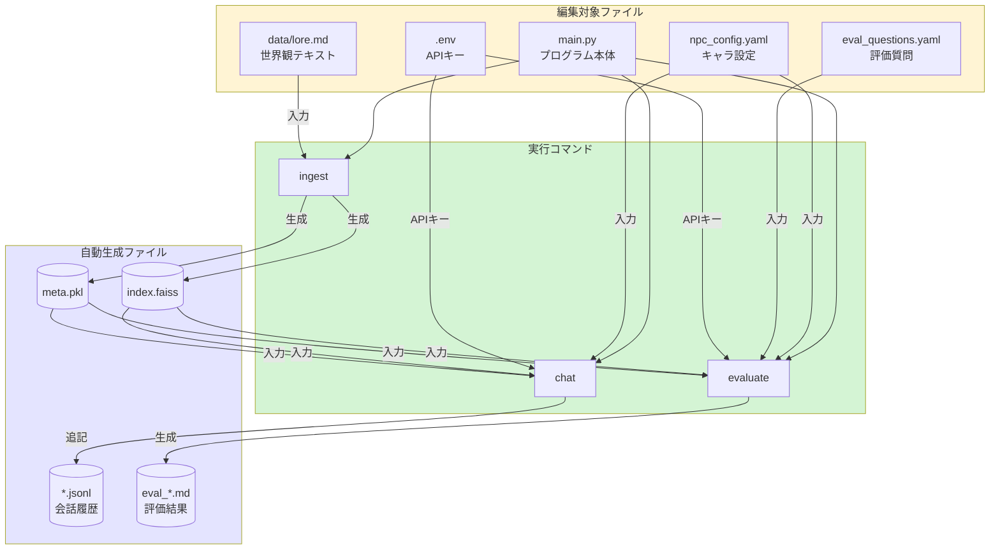
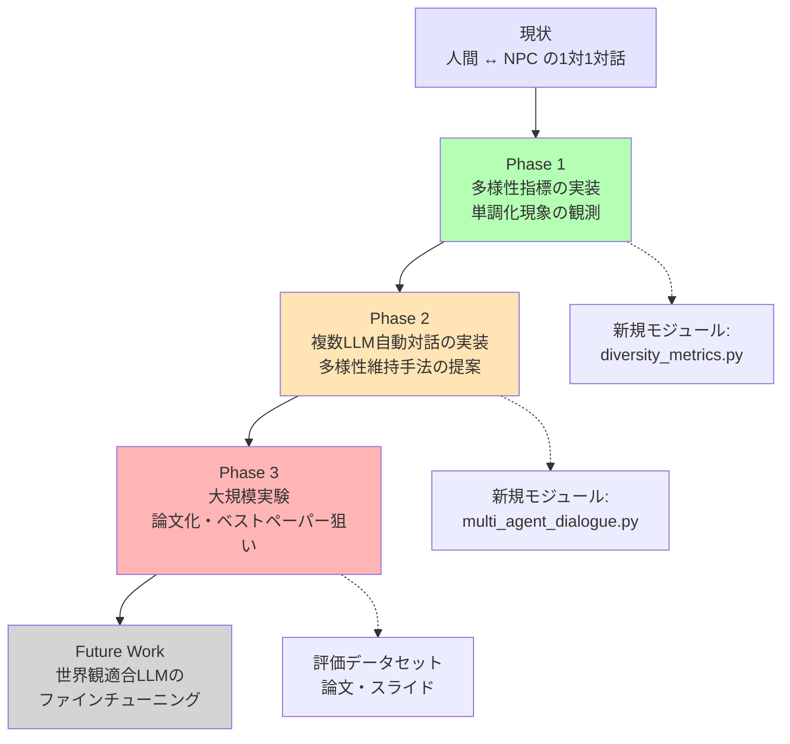

# プロジェクト処理フローチャート

このドキュメントは `joint-research` プロジェクトの主要な処理フローを図示したものです。
Mermaid 記法で書かれているため、GitHub 上でそのまま表示されます。

-----

## 1. 全体像:3つのコマンドの関係

-----

## 2. ingest コマンドの詳細フロー

```mermaid
flowchart TB
    Start([python main.py ingest])

    Read[data/lore.md を読み込み]
    Chunk[chunk_text&#40;&#41;<br/>句点優先で400文字ずつに分割<br/>50文字オーバーラップ]
    LoadModel[load_embedding_model&#40;&#41;<br/>multilingual-e5-small を<br/>HuggingFaceからロード]
    Embed["embed_texts(passage)<br/>各チャンクを384次元ベクトル化<br/>L2正規化"]
    Build[build_vector_store&#40;&#41;<br/>FAISS IndexFlatIP 構築]
    Save[save_vector_store&#40;&#41;<br/>index.faiss と meta.pkl を保存]

    End([完了])

    Lore[("data/lore.md")]
    Index[(data/vector_store/<br/>index.faiss)]
    Meta[(data/vector_store/<br/>meta.pkl)]

    Start --> Read
    Lore -.->|読み込み| Read
    Read --> Chunk
    Chunk --> LoadModel
    LoadModel --> Embed
    Embed --> Build
    Build --> Save
    Save -.->|保存| Index
    Save -.->|保存| Meta
    Save --> End

    style Lore fill:#FFE4B5
    style Index fill:#E4E4FF
    style Meta fill:#E4E4FF
```

-----

## 3. chat コマンドの詳細フロー

```mermaid
flowchart TB
    Start([python main.py chat<br/>--session test01])

    LoadCfg[load_npc_config&#40;&#41;<br/>NPC設定読み込み]
    LoadVS[load_vector_store&#40;&#41;<br/>FAISSインデックス読み込み]

    Loop{ユーザー入力待ち}

    CheckCmd{特殊コマンド?}
    Exit([終了])
    Reset[セッションファイル削除]
    Debug[デバッグモードON/OFF]

    Process[chat_with_npc&#40;&#41; 実行]

    Q["embed_texts(query)<br/>ユーザー発言をベクトル化"]
    Search[search_vector_store&#40;&#41;<br/>Top-K件の関連チャンク取得]
    History[load_recent_messages&#40;&#41;<br/>過去N件の会話履歴取得]
    BuildPrompt[build_system_prompt&#40;&#41;<br/>NPC設定+検索結果+履歴を統合]
    CallLLM[call_llm&#40;&#41;<br/>Gemini APIに送信]
    SaveMsg[save_message&#40;&#41;<br/>ユーザー発言と応答を保存]
    Display[応答を画面表示]

    NPCFile[("npc_config.yaml")]
    VSFile[("data/vector_store/")]
    ConvFile[(data/conversations/<br/>test01.jsonl)]

    Start --> LoadCfg
    NPCFile -.-> LoadCfg
    LoadCfg --> LoadVS
    VSFile -.-> LoadVS
    LoadVS --> Loop

    Loop --> CheckCmd
    CheckCmd -->|/exit| Exit
    CheckCmd -->|/reset| Reset
    CheckCmd -->|/debug| Debug
    CheckCmd -->|通常入力| Process

    Reset --> Loop
    Debug --> Loop

    Process --> Q
    Q --> Search
    Search --> History
    ConvFile -.-> History
    History --> BuildPrompt
    BuildPrompt --> CallLLM
    CallLLM --> SaveMsg
    SaveMsg -.->|追記| ConvFile
    SaveMsg --> Display
    Display --> Loop

    style Process fill:#B5E4FF
    style CallLLM fill:#FFB5B5
```

-----

## 4. evaluate コマンドの詳細フロー

```mermaid
flowchart TB
    Start([python main.py evaluate])

    LoadQ[eval_questions.yaml を読み込み]
    LoadCfg[NPC設定・ベクトルストアをロード]

    Loop{質問リストをループ}

    Process[chat_with_npc&#40;&#41; 実行<br/>※セッションは1問ごとに独立]
    Record[質問・検索チャンク・応答を記録]

    More{次の質問あり?}

    Format[Markdown形式に整形]
    Save[eval_YYYYMMDD_HHMMSS.md に保存]
    End([完了])

    QFile[("eval_questions.yaml")]
    Result[(eval_results/<br/>eval_*.md)]

    Start --> LoadQ
    QFile -.-> LoadQ
    LoadQ --> LoadCfg
    LoadCfg --> Loop

    Loop --> Process
    Process --> Record
    Record --> More
    More -->|Yes| Loop
    More -->|No| Format

    Format --> Save
    Save -.->|出力| Result
    Save --> End

    style Process fill:#B5FFB5
    style Result fill:#E4E4FF
```

-----

## 5. RAG の仕組み(コア処理)

-----

## 6. ファイル間の関係図

-----

## 7. 研究の発展フロー(将来の拡張イメージ)

-----

## 補足:Mermaid とは

このドキュメント内のフローチャートは **Mermaid** という記法で書かれています。
GitHub は標準で Mermaid をレンダリングするので、このファイルを GitHub にプッシュすれば自動的に図として表示されます。

ローカルで確認したい場合は、VS Code に「Markdown Preview Mermaid Support」拡張機能を入れると、プレビュー画面で図が見られます。

図を編集したい場合は [Mermaid Live Editor](https://mermaid.live/) でビジュアルに編集できます。